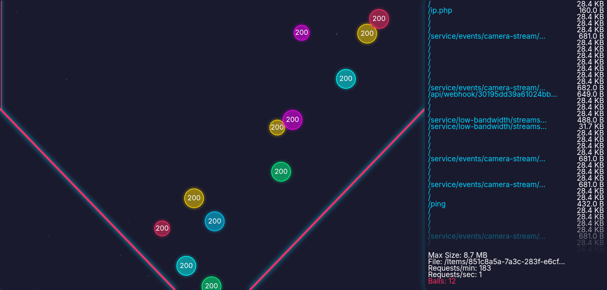

# Apache-Log-Visualizer-web
This project provides a Server-Sent Events (SSE) implementation to stream Apache access logs in real-time to a web client for visualization. The backend is written in PHP and monitors an Apache log file, parsing and streaming all log entries to the client.<br>

## Features
- Real-time streaming of Apache access logs using Server-Sent Events (SSE).
- Parses log entries to extract meaningful data (e.g., method, URL, status code, size, timestamp).
## Project Structure
- `sse.php`: The PHP script that handles log file monitoring and streams parsed log entries to the client via SSE.
- `index.html`: The frontend HTML file (currently empty) intended to display the streamed log data.
## Prerequisites
- Read permissions for the Apache log file (`/var/log/apache2/other_vhosts_access.log`) on the local server.
## Log Parsing
The `sse.php` script monitors the Apache log file using `tail -f` and parses lines in the `combined` log format. Each log entry is transformed into a JSON object with the following fields:
- `id`: Unique identifier for the log entry.
- `method`: HTTP method (e.g., GET, POST).
- `url`: Requested URL (without query parameters).
- `status`: HTTP status code (e.g., 200, 404).
- `size`: Response size in bytes.
- `timestamp`: Unix timestamp of the log entry.
## Troubleshooting
- Ensure the Apache log file (`/var/log/apache2/other_vhosts_access.log`) is readable by the PHP process (typically running as the Apache user, e.g., `www-data` on Debian/Ubuntu). Run the following commands:
   ```bash
sudo usermod -a -G adm www-data
   ```
-
